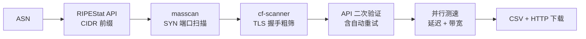

# ASNIPtest

> ASN -> CIDR -> masscan -> Cloudflare 反代节点检测 -> CSV 输出

一条命令从 ASN 编号出发，自动发现该 ASN 下所有 Cloudflare 可用节点。

---

## 快速开始

```bash
# 安装（自动处理所有依赖）
curl -fsSL https://raw.githubusercontent.com/xiaoqian-1001/ASNIPtest/main/install.sh | bash

# 使用
xiaoqian AS209242              # 单个 ASN
xiaoqian AS209242,AS3214       # 多个 ASN（逗号）
xiaoqian AS209242 -p 443,8443  # 自定义端口
xiaoqian AS209242 -w            # 宽端口模式 (25000+ 端口)
xiaoqian AS209242 -s            # 扫描后自动测速

# 管理
xiaoqian update                 # 更新
xiaoqian uninstall              # 卸载
```

无参数运行进入交互模式，按提示输入即可。完成后自动提供 CSV 下载链接。

---

## 工作流程



| # | 步骤 | 说明 |
|---|------|------|
| 1 | ASN -> CIDR | RIPEStat 免费 API 拉取 IPv4 前缀 |
| 2 | masscan | 自适应速率 SYN 扫描，XML 输出解析，仅保留 syn-ack 确认 |
| 3 | cf-scanner | Go 并发 TLS 检测，识别 CF 反代 |
| 4 | API 精筛 | 外部 API 二次验证，失败自动重试 |
| 5 | 多点测速 | TCP 延迟 + 多 URL 多体积下载测速（1MB/10MB/100MB/CDN） |
| 6 | 输出 | 生成 CSV，临时 HTTP 服务下载 |

---

## 安装方式

| 方式 | 命令 |
|------|------|
| 一键脚本 | `curl -fsSL https://raw.githubusercontent.com/E13815332/ASNIPtest/main/install.sh \| bash` |
| 手动安装 | `git clone --depth 1 https://github.com/xiaoqian-1001/ASNIPtest.git ~/ASNIPtest && cd ~/ASNIPtest/cf-scanner-src && go build -o ../cf-scanner main.go` |
| Docker | `docker build -t asniptest . && docker run --rm --cap-add=NET_RAW --network host asniptest AS209242` |

**Windows** 用户先装 WSL2：`wsl --install`，重启后在 Ubuntu 终端执行一键安装。

---

## 输出示例

```
  [download] 下载链接 (按回车关闭):
  http://192.168.1.100:8899/output_AS209242_20260101_120000.csv  (本机)
  http://1.2.3.4:8899/output_AS209242_20260101_120000.csv        (公网)

  结果: 42 条 -> output_AS209242_20260101_120000.csv
```

| 列 | 示例 |
|---|---|
| IP地址 | `162.159.192.1` |
| 端口 | `443` |
| TLS | `TRUE` |
| 数据中心 | `HKG` |
| 地区 | `HK` |
| 城市 | `Hong Kong` |
| 网络延迟 | `42` (ms) |
| 下载速度 | `5.12` (Mbps) |
| ASN | `AS209242` |

---

## 项目结构

```
ASNIPtest/
├── run.py                 主入口，流程编排
├── verify.py              API 精筛（含重试）
├── lib/utils.py           公共工具（进度条/IP检测/端口解析）
├── cf-scanner-src/        Go 源码（TLS 握手检测）
├── cf-scanner             编译产物（gitignore）
├── install.sh             一键安装
├── uninstall.sh           一键卸载
├── ports.txt              TLS 端口列表
├── Dockerfile
└── VERSION
```

---

## 硬件自适应

启动时探测网卡发包上限，按 CPU 核数和内存自动调参：

| 参数 | 策略 |
|------|------|
| masscan 速率 | 实测网卡上限 x 80%，失败回退 CPU x 1000 |
| cf-scanner 并发 | `max(200, min(cores * 100, 500))` |
| API 并发 | `min(cores * 16, 32)` |
| 测速并发 | 等于 API 并发，全部节点并行 |

---

## 依赖

| 组件 | 用途 |
|------|------|
| [masscan](https://github.com/robertdavidgraham/masscan) | 高速 SYN 端口扫描 |
| Go >= 1.22 | 编译 cf-scanner |
| Python >= 3.8 | 流程编排、API 验证 |
| dnsutils | DNS 方式获取公网 IP |
| [RIPEStat API](https://stat.ripe.net/) | ASN -> CIDR（免费公开） |

> `install.sh` 自动安装所有依赖。

### 环境限制

masscan 需要 `CAP_NET_RAW`，以下环境不可用：NAT 容器、OpenVZ/LXC（无特权模式）、WSL2 默认桥接。建议使用 KVM VPS 或物理机。

---

## 更新日志

### v1.4.0
- 宽端口扩展: 912 + 10000-65535，覆盖完整高位区间
- 随机端口优化: 权重向 20000-60000 倾斜 10 倍 + 自动去重
- 分批扫描: 超 5000 端口自动拆分批次，防止内存爆炸
- 动态并发: 实时监控 CPU/内存，负载过高自动下调线数

### v1.3.0
- masscan 改用 XML 输出解析，仅保留 `syn-ack` 确认端口，过滤 `rst-ack` 噪音
- 多点测速：多 URL (1MB/10MB/100MB/CDN) 取最佳带宽
- 新增 `-w` / `--wide` 宽端口模式 (25000+ 端口)

### v1.2.0
- 全面架构升级：ScannerConfig 数据类、argparse CLI、多阶段 Dockerfile
- 修复中间文件残留导致测速读取过期数据
- 安装脚本 mktemp 加固、卸载确认

---

## 鸣谢

- [e13815332](https://github.com/e13815332) -- 原作者，项目架构与核心扫描流程
- [cmliu](https://github.com/cmliu) -- [CF-Workers-CheckProxyIP](https://github.com/cmliu/CF-Workers-CheckProxyIP) 公共 API
