<p align="center">
  <br>
  
  
  
  
</p>

<h1 align="center">IP-Tidy</h1>
<p align="center"><b>LITTLE MONEY ASN NSD TOOL</b></p>
<p align="center">ASN / CIDR &rarr; Masscan &rarr; CF Detection &rarr; CSV</p>
<p align="center"><b>English</b> | <a href="README_ZH.md"><b>中文</b></a></p>

---

<p align="center">
  
</p>

---

## Features

| Feature | Description |
|---------|-------------|
| Smart Subnet Tiering | Large CIDRs auto-split into /24s, sample-probe, scan only active subnets (`--smart`) |
| Deep Mining | Extract /16 CIDRs from discovered IPs, re-run full pipeline for more hits |
| MCIS Search | Monte Carlo IP Searcher finds optimal IPs within CIDR ranges, with auto route tracing (`--mcis`) |
| Offline GeoIP | Built-in MaxMind GeoLite2 — no network needed for ISP / region / ASN lookup |
| Multi-Source Input | ASN numbers / CIDR ranges / mixed, any combination |
| Wide Port Scan | Two-phase wide port scanning on hit IPs to uncover hidden high ports |
| Hardware Adaptive | Auto-detect NIC cap, CPU/memory dynamic tuning |
| Resume Support | `--skip-masscan` to skip scan and reuse previous results |
| Port Batching | Large port ranges auto-split into batches for smooth progress |
| Port Modes | Default / Wide / Random / Probe-append / Custom |
| ASN Cache | RIPEStat results cached for 7 days, auto-fallback on failure |
| TCP/HTTP Latency | Dual-protocol latency measurement |
| CSV Enhanced | IP location + ASN org + GeoIP auto-filled |
| Cross-Platform | Linux / macOS / Windows (WSL2) |
| Incremental Scan | `-i` scans only new CIDRs from ASN, merges with historical results |

---

## Quick Start

### Install

```bash
# One-command install, auto-handles all dependencies
curl -fsSL https://raw.githubusercontent.com/xiaoqian-1001/IP-Tidy/main/install.sh | bash
```

### Basic Usage

```bash
qian AS209242                     # Single ASN
qian AS209242,AS3214              # Multiple ASNs (comma-separated)
qian 1.2.3.0/24                   # Single IPv4 CIDR
qian 1.2.3.0/24,5.6.7.0/24      # Multiple IPv4 CIDRs
qian AS209242,1.2.3.0/24         # ASN + CIDR mixed
```

### Common Options

```bash
-p 443,8443    # Custom ports
-w             # Wide port mode (55546 ports)
-R             # Random 5 ports (full port range)
-P 10          # Append N random probe ports to defaults
-d             # Deep scan (wide ports on hit IPs)
-s             # Speed test after scan
-c             # CloudflareSpeedTest for bandwidth measurement (--cfst-count)
--mcis         # MCIS search: find optimal IPs from source CIDR
               # Shortcut: qian mcis <ASN/CIDR> skips scan
-i             # Incremental scan (new CIDRs only, merge history)
-r 4000        # Set masscan rate
--smart        # Smart subnet tiering (large CIDR auto-probe)
--cfst-count 30  # cfst top N optimal IPs (default 15)
-g             # Download offline GeoIP database
```

### Management & Combinations

```bash
qian AS209242 -w -d -s -i         # Combined usage
qian AS209242 -c --cfst-count 20  # Scan + cfst, top 20
qian AS209242 --mcis              # MCIS search for optimal nodes
qian mcis AS209242                # Shortcut: skip scan, direct MCIS
qian AS209242 --skip-masscan      # Resume from last scan
qian update                       # Update to latest
qian uninstall                    # Uninstall
```

> **Tip**: Run without arguments to enter interactive mode. HTTP download server auto-starts on completion.

---

## Offline GeoIP (`-g`)

Built-in MaxMind GeoLite2 free database. Once downloaded, no network needed for local ISP/region/ASN queries.

```bash
# First use — download offline database
qian -g
# Follow prompts: register at maxmind.com, enter License Key
# Database saved to ~/.config/ip-tidy/

# Daily runs auto-use offline database
qian AS209242
# Output:
#   [GeoIP] 离线数据库 (MaxMind GeoLite2)
#   Region: Shanghai, CN   ISP: Alibaba
```

> Falls back to ipinfo.io online query when offline DB is unavailable.

---

## Smart Subnet Tiering (`--smart`)

Large CIDRs (e.g. `/16`) auto-split into /24 subnets. Each subnet samples 3 IPs for TCP 443 probe — only active subnets go to masscan, drastically reducing scan time.

```bash
qian 10.0.0.0/16 --smart
# /16 -> 256 /24 subnets, 3 sample IPs each
# Only active subnets enter masscan, filters dead segments xx%
# Auto-fallback to full scan if no survivors
```

> **Principle**: Cloudflare IPs cluster in specific /24 subnets. Many /24s are completely dead — skipping them compresses scan time by orders of magnitude.

---

## Workflow

```mermaid
graph LR
    A["ASN / CIDR"] --> B["RIPEStat API + Cache<br/>IPv4 Prefix Resolution"]
    B --> C["Subnet Tiering Probe<br/>Large CIDR -> /24 Sampling"]
    C --> D["masscan<br/>IPv4 CIDR SYN Scan"]
    D --> E["cf-scanner + API<br/>CF Detection + Filtering"]
    E --> F["CIDR Deep Mining<br/>IP -> /16 CIDR Re-scan"]
    F --> G["MCIS Search (optional)"]
    G --> H["Wide Port Scan (optional)<br/>Hit IPs + Wide Ports"]
    H --> I["Speed Test (optional)<br/>TCP + HTTP + Download"]
    I --> J["CSV Output + HTTP Download"]
```



| # | Step | Description |
|:-:|------|-------------|
| 1 | ASN CIDR Extraction | RIPEStat API fetches IPv4 prefixes (7-day cache), CIDR pass-through |
| 2 | Subnet Tiering Probe | Large CIDR split /24 sample-probe, keep active subnets only (`--smart`) |
| 3 | masscan Port Scan | Adaptive-rate SYN scan, XML parse, keep syn-ack only |
| 4 | CF Detection + API Filter | Go cf-scanner CF detection + API double-verify |
| 5 | CIDR Deep Mining | Extract /16 CIDRs from hit IPs, re-run full pipeline |
| 6 | MCIS Search (optional) | Monte Carlo search for optimal IPs within CIDR range (`--mcis`) |
| 7 | Wide Port Scan | Append wide ports on hit IPs, two-phase for max yield |
| 8 | Speed Test | TCP + HTTP latency + multi-URL download speed test |
| 9 | Output | CSV (with IP location / ASN org), start HTTP download server |

---

## Deep Scan (`-d`)

Phase 1 scans default ports. Phase 2 appends 55546 wide ports on cf-scanner hit IPs.

```bash
qian AS209242 -d
# Phase 1: Default port scan
# Phase 2: Wide port scan on hit IPs
```

> **Use case**: After default port scan, mine more usable IPs. Only scans hit IPs, not full CIDR — maximizes yield without major time increase.

---

## Deep Mining

Auto-extracts /16 CIDRs from passed IPs, re-runs full pipeline on expanded ranges to find more IPs in the same segment.

```bash
qian AS209242
# After CF detection, auto-prompt:
#   [Current] 5 IPs passed
#   Enable deep mining? (y/n, Enter to skip):
```

| Sub-step | Description |
|:---------|-------------|
| IP Extraction | Extract IPv4 addresses from passed IPs |
| CIDR Conversion | Convert each IP to /16, deduplicate |
| Full Scan | masscan + cf-scanner + API filter full pipeline |
| Merge | New IPs appended to verified.txt, passed_count auto-accumulates |

> No extra params needed. Interactive confirmation after scan completes.

---

## MCIS Search (`--mcis` / `qian mcis`)

After scan, extracts CIDR ranges from passed IPs, uses Monte Carlo IP Searcher to find optimal nodes within those ranges, replaces original results. Results auto-include NextTrace route analysis.

```bash
qian AS209242 --mcis
qian mcis AS209242              # Shortcut: skip scan, parse ASN, run MCIS
```

| Parameter | Default | Description |
|:----------|---------|-------------|
| CIDR Prefix | /24 | CIDR prefix length for IP expansion (adjustable in interactive) |
| Budget | auto | `max(3000, min(subnets x 100, 50000))` dynamic |
| Concurrency | 200 | Parallel probes |
| Search Heads | 4 | Monte Carlo search heads |
| Beam Width | 32 | Beam search width |
| TOP | 20 | Keep top N optimal IPs |
| Download Test | 5 | IPs for actual download speed test |
| --mcis-url | (empty) | Custom speed test URL |
| --mcis-host | (empty) | Custom speed test Host header |

**Result table columns**:

| IP | Latency(ms) | Speed(MB/s) | Colo | Prefix | Route |
|:---|:------------|:------------|:-----|:-------|:------|

- Blank speed column shows `-`, IPs with speed sort first
- Route auto-determined by NextTrace: premium=green, optimized=yellow, normal=white
- Route label format: `ISP｜Line｜Tier` (e.g. `China Mobile｜CMIN2｜Premium`)
- `--mcis-url` / `--mcis-host`: custom speed test URL and Host header
- NextTrace auto TCP probe (443 -> 80 -> ICMP fallback), 18s timeout
- ASN parsing auto-compatible with nexttrace `--table` bare number format
- Auto-fallback to ip-api.com when no ASN obtained
- Route table covers 15 ASNs (CMIN2/CN2/CUII premium, CMI/163/169/CMHK/CERNET optimized)
- Unmatched ASNs display as `Normal｜Backbone`
- Concurrency: 20 -> 5, `pending` results single-thread retry

> MCIS replaces the speed test step. `qian mcis <ASN/CIDR>` shortcut skips Masscan / Deep Mining, directly resolves ranges and runs MCIS.

---

## Installation Methods

| Method | Command |
|:-------|---------|
| One-liner | `curl -fsSL https://raw.githubusercontent.com/xiaoqian-1001/IP-Tidy/main/install.sh \| bash` |
| Manual | `git clone --depth 1 https://github.com/xiaoqian-1001/IP-Tidy.git ~/IP-Tidy && cd ~/IP-Tidy/cf-scanner-src && go build -o ../cf-scanner main.go` |

> **Windows**: Install WSL2 first (`wsl --install`), reboot, then run the one-liner in Ubuntu terminal.

---

## Output Example

```
Download - Press Enter to close
http://192.168.1.100:8899/output_AS209242_20260623_120000.csv
http://1.2.3.4:8899/output_AS209242_20260623_120000.csv
```

| Column | Example | Description |
|:-------|---------|-------------|
| IP | `162.159.192.1` | Cloudflare IP |
| Port | `443` | Open port |
| TLS | `TRUE` | TLS enabled |
| Colo | `HKG` | Cloudflare colo code |
| Location | `Hong Kong, HK` | City + Country |
| Region | `HK` | Country/Region |
| City | `Hong Kong` | City |
| Latency | `42` | ms |
| Protocol | `IPv4` | IPv4 |
| ASN | `AS209242` | Source ASN |
| ASN Org | `Alibaba` | ASN organization |

---

## Project Structure

```
IP-Tidy/
  run.py                 CLI entry — terminal interaction + step rendering
  verify.py              API filter (with retry)
  lib/
    scanner_utils.py     Pure function layer
    scanner_pipeline.py  Pipeline layer (ASN CIDR + masscan + CF + verify)
    utils.py             Terminal utilities (progress bar / network / port parse)
    geoip.py             Offline GeoIP (MaxMind GeoLite2)
  cf-scanner-src/        Go source (TLS handshake detection)
  cf-scanner             Compiled binary (gitignored)
  install.sh             One-command install
  uninstall.sh           One-command uninstall
  ports.txt              TLS port list
  Dockerfile / VERSION
```

---

## Architecture

```text
lib/scanner_utils.py     Pure functions  — CIDR split, port parse, subnet probe, latency, cert query
lib/scanner_pipeline.py  Pipeline       — ASN->CIDR, masscan, cf-scanner, verify, smart probe
                         signals        — progress_callback for progress reporting
run.py                   CLI entry      — argparse + terminal interaction + step orchestration + rendering
```

> Modify scan logic by editing `lib/scanner_pipeline.py`.

---

## Hardware Adaptive

On startup, detects NIC send cap, auto-tunes by CPU cores and memory:

| Parameter | Strategy |
|:----------|----------|
| masscan rate | NIC cap x 80%, fallback CPU x 1000 |
| cf-scanner concurrency | `max(200, min(cores x 100, 500))` |
| API concurrency | `min(cores x 16, 32)` |
| Batch split | Max 5000 ports per batch, auto-split |
| Speed test concurrency | Equal to API concurrency, all IPs in parallel |

---

## Dependencies

| Component | Purpose |
|:----------|---------|
| [masscan] | High-speed SYN port scanner |
| Go >= 1.22 | Compile cf-scanner (TLS handshake) |
| Python >= 3.8 | Orchestration, API verification |
| maxminddb | GeoLite2 offline DB reader (pypi) |
| dnsutils | Public IP via DNS |
| [RIPEStat API] | ASN -> CIDR (free, public) |

> `install.sh` auto-installs all dependencies (including `pip3 install maxminddb`).

### Environment Restrictions

masscan requires `CAP_NET_RAW`. Unavailable on:
- NAT containers
- OpenVZ / LXC (no privileged mode)
- WSL2 default bridge

> Recommended: KVM VPS or bare metal.

### Note

- Do not run on production servers or major cloud VPS
- Use complaint-friendly VPS providers
- Avoid high-frequency runs on residential broadband

---

## Changelog

### v3.0.0

- [New] Bilingual README: English default, Chinese toggle at top
- [New] Route label fallback: `--｜Backbone｜Normal` changed to `Non-Premium｜Normal｜Backbone`
- [New] Region distribution: priority display for Hong Kong, Singapore, Japan, Korea, Taiwan; remaining regions collapsible
- [Fix] [Environment] line shows empty city gracefully, uses composite location string
- [Fix] `Non-Premium｜Normal｜Backbone` no longer falsely colored as premium (green) — uses `｜Premium` suffix match
- [Fix] Local IP query table re-added after accidental removal during region distribution edit
- [Fix] GeoIP display prefers Chinese names (`country_cn` / `city_cn`), falls back to ISO codes

### v2.9.0

- [Optimization] Route label format unified: `ISP｜Line｜Tier` (`/` replaced by `｜`), route table expanded to 15 ASNs
- [New] `--mcis-url` / `--mcis-host`: custom speed test URL and Host header
- [Optimization] Traceroute reliability: TCP 443 -> 80 -> ICMP fallback, 18s timeout, nexttrace `--table` bare number format and hostname column offset compatible
- [New] ASN fallback query: auto ip-api.com when nexttrace fails to get ASN
- [Optimization] No default third-party speed test URL, prevents link expiration
- [Optimization] Trace route auto-execute, removed interactive confirmation
- [Optimization] Concurrency 20 -> 5, `pending` results single-thread retry (25s timeout)
- [Optimization] Route column width 18 -> 24, accommodates longest CJK+ASCII mixed labels

### v2.8.0

- [New] NextTrace route analysis: MCIS results auto-trace each IP's ASN route, new "Route" column (premium=green, optimized=yellow, normal=white)
- [New] Auto-terminate on probe: when best holds 6000ms, auto-stop MCIS, skip speed test phase
- [Optimization] Budget fully auto-calculated: `max(3000, min(subnets x 100, 50000))`, removed manual input
- [Optimization] Result sorting: IPs with download speed sort first, blank speed shows `-`
- [Optimization] Header simplified: `Download Speed(MB/s)` -> `Speed(MB/s)`
- [Optimization] Interactive mode simplified: removed all MCIS parameter prompts, kept only CIDR prefix
- [Optimization] MCIS history protection: old results kept as `.bkp` until new run succeeds
- [Fix] `--cfst-count 0` incorrectly falling back to default 15
- [Cleanup] Removed duplicate code, redundant proc.wait(), dead code

<details>
<summary>Earlier versions</summary>

### v2.7.0

- [New] MCIS Search: Monte Carlo IP Searcher for optimal nodes within CIDR range (`--mcis`), replaces traditional speed test
- [New] Download speed filtering: MCIS results only keep `ok=true` IPs (TLS/download verified), auto-discard invalid nodes
- [New] Result table enhanced: MCIS and CFST both show "Colo" column, MCIS shows "Prefix" column
- [Optimization] MCIS auto-downloads binary, no manual install needed
- [Optimization] MCIS results fully replace original verified.txt, seed IPs only used for CIDR expansion

### v2.6.0

- [New] 1MB pre-filter: CFST speed test uses 1MB file for quick pre-screening, candidate pool shrinks to 2xN, significantly reduces time
- [New] Weighted scoring: CFST results re-ranked by bandwidth x 3 + latency x 1
- [Optimization] CF-RAY validation: case-insensitive matching, auto-fallback to all alive IPs when no CF-RAY
- [Fix] `cf_download` uses http.client + socket direct connect, fixes urllib DNS resolution causing invalid speed data
- [Fix] `step_speed_test` done variable uninitialized crash
- [Optimization] cfst process 600s timeout guard, prevents hung process
- [Optimization] Sliding window fix: warm-up consumes data normally + 10MB download cap

### v2.5.0

- [New] RTT probe optimization: single TCP handshake reuses HTTP `/cdn-cgi/trace` probe, extracts CF-RAY and colo
- [New] Colo grouping: per-colo min-heap keeps Top-N, improves speed test candidate diversity

### v2.4.1

- [New] RTT pre-filter: when candidates exceed cfst limit, auto TCP concurrent RTT sort to trim pool
- [Cleanup] Removed experimental features: custom speed test, CF-RAY validation, fission discovery
- [Cleanup] Code refactor: eliminated duplicate patterns, extracted common functions, removed unused imports

### v2.4.0

- [Fix] cfst progress bar fragile parsing, added heartbeat fallback
- [Fix] install.sh uninstall deleting wrong paths
- [Cleanup] Code refactor: magic numbers centralized, `_run_masscan_batches()` extracted, `_format_csv_line()` deduplicated
- [Optimization] Dockerfile cross-compile fix (ARG TARGETARCH + GOARCH)

### v2.3.0

- [New] CloudflareSpeedTest integration: optional speed test tool for result IPs after scan
- [New] cfst supports custom top N (`--cfst-count`), default 15
- [New] cfst real-time progress bar with ETA estimation
- [New] `-c` / `--cfst` skips interactive prompt, runs directly
- [Optimization] Dockerfile pre-downloads cfst binary

### v2.2.5

- [Cleanup] Masscan XML parse extracted as `parse_masscan_xml()` utility, eliminated 3 duplicate locations
- [Cleanup] `main()` split into 6 sub-functions
- [Cleanup] Removed unused imports in `scanner_pipeline.py` and `run.py`
- [Fix] `random_probe_ports()` interval rotation bug: `% 3` -> `% 4`
- [Fix] Exception handling distinguishes `KeyboardInterrupt`, exit code 130 on user cancel
- [Fix] Go cf-scanner ANSI escape no longer outputs control chars in non-TTY environments
- [Optimization] Dockerfile workdir `ASNIPtest` -> `IP-Tidy`

### v2.2.4

- [New] `-i` / `--incremental` incremental scan: only scans new CIDRs, auto-merges with historical results

### v2.2.3

- [New] `-P N` / `--probe-ports`: append N random probe ports to default ports
- [Optimization] `-R` random ports from weighted intervals to full-range pure random

### v2.2.2

- [New] API filter phase extracts probe timestamps, fills latency column directly
- [Optimization] Shortcut command `xiaoqian` -> `qian`
- [Optimization] Color system refactored: 10-color semantic layering
- [Fix] `install.sh` repo path `ASNIPtest` -> `IP-Tidy`
- [Fix] help examples `ip-tidy` -> `qian`

### v2.2.1

- [Fix] `_pipeline` background verify threads duplicated execution causing 2x total time
- [Fix] Deep mining masscan progress bar real-time display
- [Fix] Speed test CSV download speed column null values
- [Optimization] Speed test / deep mining add `step duration` output

### v2.2

- [Optimization] Deep mining output format streamlined, matching main flow style

### v2.1.1

- [New] Deep mining: extract /16 CIDRs from acquired IPs, re-run full pipeline
- [New] HTTP latency: HTTP HEAD request latency measurement
- [New] CSV enhanced: output includes IP location / ASN org columns
- [Cleanup] Removed WEB mode and related code

### v2.1.0

- [New] Smart subnet probe: large CIDR split /24 sample TCP probe
- [New] GeoIP status bar display, server hardware info
- [New] RIPEStat ASN CIDR resolution (7-day cache)

### v2.0.3

- [Fix] ASN cache empty results causing continuous 0 CIDR resolution
- [Fix] print_step / print_banner extra blank lines
- [New] Smart subnet tiering (`--smart`): large CIDR split /24 sample TCP probe

### v2.0.1

- [New] Offline GeoIP: built-in MaxMind GeoLite2

### v2.0.0

- Renamed to IP-Tidy (formerly ASNIPtest)
- CIDR direct input support
- Terminal UI ASCII restructured
- Deep scan per-batch instant feedback + result merge explicit comparison
- CSV HTTP download service restored
- Fix masscan stderr read cross-platform compatibility

### v1.5.0

- Streaming pipeline: cf-scanner + API filter merged execution
- Deep scan (`-d`): two-phase max yield
- ASN CIDR cache: 7-day TTL + failure fallback
- Resume support (`--skip-masscan`)

### v1.4.0

- Wide port expansion: 912 + 10000-65535
- Dynamic concurrency: CPU/memory real-time monitoring

### v1.3.0

- masscan XML output parsing (syn-ack filter)
- Multi-point speed test + `-w` wide port mode

### v1.2.0

- ScannerConfig dataclass architecture + argparse CLI
- Multi-stage Dockerfile + install script hardening

</details>

---

## Credits

- [e13815332] — Original author, project architecture and core scan pipeline
- [cmliu] — [CF-Workers-CheckProxyIP] public API
- [XIU2] — [CloudflareSpeedTest] speed test tool
- [Leo-Mu] — [Monte Carlo IP Searcher] optimal node search
- [nxtrace] — [NTrace-core] route tracing engine

[masscan]: https://github.com/robertdavidgraham/masscan
[RIPEStat API]: https://stat.ripe.net/
[e13815332]: https://github.com/e13815332
[cmliu]: https://github.com/cmliu
[CF-Workers-CheckProxyIP]: https://github.com/cmliu/CF-Workers-CheckProxyIP
[XIU2]: https://github.com/XIU2
[CloudflareSpeedTest]: https://github.com/XIU2/CloudflareSpeedTest
[Leo-Mu]: https://github.com/Leo-Mu
[Monte Carlo IP Searcher]: https://github.com/Leo-Mu/montecarlo-ip-searcher
[nxtrace]: https://github.com/nxtrace
[NTrace-core]: https://github.com/nxtrace/NTrace-core