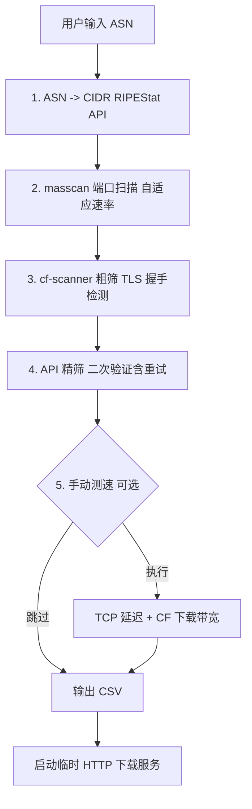

# ASNIPtest

从 **ASN 编号** 出发，自动完成 IP 段拉取 → 端口扫描 → Cloudflare 反代节点检测，输出可用 CF 节点 CSV。

---

## 目录

- [快速开始](#快速开始)
- [安装](#安装)
- [使用](#使用)
- [工作流程](#工作流程)
- [项目结构](#项目结构)
- [输出格式](#输出格式)
- [硬件自适应](#硬件自适应)
- [依赖](#依赖)
- [卸载](#卸载)

---

## 快速开始

```bash
# Linux / macOS 一键安装
curl -fsSL https://raw.githubusercontent.com/e13815332/ASNIPtest/main/install.sh | bash
```

**Windows**（需先装 WSL2）：

```powershell
# PowerShell 管理员模式，装完重启
wsl --install

# 重启后进 Ubuntu 终端
curl -fsSL https://raw.githubusercontent.com/e13815332/ASNIPtest/main/install.sh | bash
```

安装完成后在任意目录输入 `cmtjd` 即可启动。

---

## 安装

### 自动安装

一条命令安装所有依赖（masscan、dnsutils、Go 1.22、Python3）并注册全局命令 `cmtjd`：

```bash
curl -fsSL https://raw.githubusercontent.com/e13815332/ASNIPtest/main/install.sh | bash
```

脚本自动完成：系统依赖安装 → Go 编译 cf-scanner → 注册 `cmtjd` 快捷命令 → 启动扫描。

### 手动安装

```bash
git clone --depth 1 https://github.com/e13815332/ASNIPtest.git ~/ASNIPtest

# 安装系统依赖
sudo apt install -y masscan dnsutils python3

# 编译 cf-scanner（需 Go >=1.22）
cd ~/ASNIPtest/cf-scanner-src
go build -o ../cf-scanner main.go
chmod +x ../cf-scanner

# 运行
cd ~/ASNIPtest && python3 run.py
```

### Docker

```bash
docker build -t asniptest .
docker run --rm --cap-add=NET_RAW --network host asniptest AS209242
```

---

## 使用

### 命令行模式

```bash
cmtjd AS209242              # 单个 ASN
cmtjd AS209242,AS3214       # 多个 ASN（逗号分隔）
cmtjd AS209242 AS3214       # 多个 ASN（空格分隔）
cmtjd AS209242 -p 443,8443  # 自定义端口
```

### 交互模式

不带参数运行，进入交互提示：

```bash
cmtjd
```

```
  硬件: 4核 2048MB -> masscan 4000pps cf-scanner 400c API 32c

  本机公网 IP: 1.2.3.4
  地区: Tokyo, JP  运营商: xxx

  输入 ASN 编号 (多个用逗号分隔): _
```

输入 ASN 后自动开始扫描，完成后提供 CSV 下载链接。扫描完成后可选手动测速（TCP 延迟 + CF 下载带宽）。

### 更新 / 卸载

```bash
cmtjd update       # 更新到最新版
cmtjd uninstall    # 卸载
```

---

## 工作流程



| 步骤 | 工具 | 说明 |
|------|------|------|
| 1. ASN -> CIDR | RIPEStat API | 免费公开，查询该 ASN 广播的所有 IPv4 前缀 |
| 2. masscan | masscan | 高速 SYN 扫描（CIDR 直接传入，自适应速率） |
| 3. cf-scanner | Go 二进制 | TLS 握手检测 Cloudflare 反代节点，并发 200-500 |
| 4. API 精筛 | verify.py | api.090227.xyz/check 二次验证，失败自动重试 2 次 |
| 5. 手动测速 | curl + socket | TCP 延迟 + CF 文件下载速度 |
| 6. 输出 | HTTP Server | 临时 HTTP 服务提供 CSV 下载，按回车关闭 |

---

## 项目结构

```
ASNIPtest/
├── run.py                 # 主入口，流程编排
├── verify.py              # API 精筛模块（含重试机制）
├── lib/
│   ├── __init__.py
│   └── utils.py           # 公共工具（进度条、网络检测、端口解析）
├── cf-scanner-src/
│   ├── main.go            # cf-scanner 源码（Go，TLS 握手检测）
│   └── go.mod
├── cf-scanner             # 编译后的二进制（gitignore）
├── install.sh             # 一键安装脚本
├── uninstall.sh           # 一键卸载脚本
├── Dockerfile             # Docker 构建文件
├── ports.txt              # 默认 TLS 端口列表
├── VERSION                # 版本号
└── .gitignore
```

---

## 输出格式

运行完成后生成 CSV 并启动临时下载服务：

```
  [download] 下载链接 (按回车关闭):
  http://192.168.1.100:8899/output_AS209242_20260617_120000.csv  (本机)
  http://1.2.3.4:8899/output_AS209242_20260617_120000.csv  (公网)

  结果: 42 条 -> output_AS209242_20260617_120000.csv
```

CSV 列说明：

| 列 | 说明 | 示例 |
|---|---|---|
| IP地址 | Cloudflare 节点 IP | `162.159.192.1` |
| 端口 | TLS 端口 | `443` |
| TLS | TLS 版本 | `TRUE` |
| 数据中心 | CF 数据中心代号 | `HKG` |
| 地区 | 国家/地区代码 | `HK` |
| 城市 | 城市名 | `Hong Kong` |
| 网络延迟 | TCP 延迟 (ms) | `42` |
| 下载速度 | CF 下载带宽 (Mbps) | `5.12` |
| ASN | 源 ASN 编号 | `AS209242` |

---

## 硬件自适应

启动时自动探测网卡实际发包能力，同时根据 CPU 核数和内存调整并发：

| 硬件配置 | masscan 速率 | cf-scanner 并发 | API 并发 |
|---|---|---|---|
| 任何配置 | 自动实测网卡上限 * 80% | 200 - 500 | 8 - 32 |

速率探测耗时约 30 秒，以前 50 个 CIDR 样本递增速率测试。探测失败时回退为 CPU 核数 * 1000 估算。

---

## 依赖

| 工具 | 用途 | 安装方式 |
|---|---|---|
| [masscan](https://github.com/robertdavidgraham/masscan) | 高速端口扫描 | `apt install masscan` 或源码编译 |
| [Go](https://go.dev/) >= 1.22 | 编译 cf-scanner | install.sh 自动安装 |
| [RIPEStat API](https://stat.ripe.net/) | ASN -> CIDR | 免费公开，无需注册 |
| dnsutils | DNS 方式获取公网 IP | `apt install dnsutils` |
| Python 3.8+ | 流程编排与 API 验证 | 系统自带或 `apt install python3` |

`install.sh` 自动处理所有依赖。

### 不支持的环境

masscan 依赖 raw socket（CAP_NET_RAW），以下环境有限制：

- 不支持 NAT 容器（缺少 CAP_NET_RAW）
- 不支持 OpenVZ / LXC 未开启特权模式
- WSL2 需切换为 NAT 网络模式（默认桥接不支持 raw socket）

换到 KVM VPS 或物理机即可正常使用。

---

## 卸载

```bash
curl -fsSL https://raw.githubusercontent.com/e13815332/ASNIPtest/main/uninstall.sh | bash
```

这会删除 `cmtjd` 命令和 `~/ASNIPtest` 目录。

---

## 鸣谢

- [**cmliu**](https://github.com/cmliu) --- 提供 [CF-Workers-CheckProxyIP](https://github.com/cmliu/CF-Workers-CheckProxyIP) 公共 API 接口 (`api.090227.xyz/check`)，用于节点二次验证
