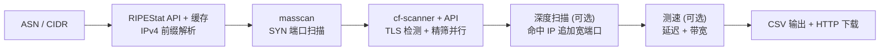

# IP-Tidy

> **小钱 ASN NSD TOOL** -- ASN / CIDR -> Masscan -> TLS 检测 -> CF 节点 CSV

一键输入 ASN 或 CIDR，自动完成 IP 段解析、高速端口扫描、Cloudflare 反代节点检测，输出结构化 CSV 并提供 HTTP 下载。

---

## 特性

| 特性 | 说明 |
|------|------|
| 多输入源 | 支持 ASN 编号、CIDR 网段、混合输入 |
| 深度扫描 | 二阶段宽端口扫描，发现隐藏高位端口 |
| 流式流水线 | cf-scanner 与 API 精筛并行，缩短等待 |
| 硬件自适应 | 实测网卡上限，CPU/内存动态调参 |
| 断点续扫 | `--skip-masscan` 跳过扫描复用已有结果 |
| 端口拆分 | 超大范围自动拆批，进度平滑 |
| ASN 缓存 | RIPEStat 结果 7 天缓存，失败回退 |
| 跨平台 | Linux / macOS / Windows (WSL2) |

---

## 快速开始

```bash
# 安装 (自动处理所有依赖)
curl -fsSL https://raw.githubusercontent.com/xiaoqian-1001/IP-Tidy/main/install.sh | bash

# 基础用法
ip-tidy AS209242                     # 单个 ASN
ip-tidy AS209242,AS3214              # 多个 ASN (逗号)
ip-tidy 1.2.3.0/24                   # 单个 CIDR
ip-tidy 1.2.3.0/24,5.6.7.0/24      # 多个 CIDR
ip-tidy AS209242,1.2.3.0/24         # ASN + CIDR 混合

# 选项
ip-tidy AS209242 -p 443,8443         # 自定义端口
ip-tidy AS209242 -w                  # 宽端口 (55546 端口)
ip-tidy AS209242 -R                  # 随机 5 端口快速探测
ip-tidy AS209242 -d                  # 深度扫描 (命中 IP 追加宽端口)
ip-tidy AS209242 -s                  # 扫描后自动测速
ip-tidy AS209242 -r 4000             # 指定发包速率
ip-tidy AS209242 -w -d -s            # 组合使用

# 断点续扫
ip-tidy AS209242 --skip-masscan      # 跳过 masscan，使用已有结果

# 管理
ip-tidy update                       # 更新到最新版
ip-tidy uninstall                    # 卸载
```

无参数运行自动进入交互模式，按提示输入即可。完成后自动启动 HTTP 下载服务。

---

## 工作流程



| # | 步骤 | 说明 |
|---|------|------|
| 1 | ASN/CIDR -> 前缀 | RIPEStat API 拉取 IPv4 前缀 (7天缓存)，CIDR 直通 |
| 2 | masscan | 自适应速率 SYN 扫描，XML 解析，仅保留 syn-ack |
| 3 | CF 检测 + 精筛 | Go cf-scanner TLS 握手检测 + API 二次验证 |
| 4 | 深度扫描 (可选) | 对命中 IP 追加宽端口，两阶段产出最大化 |
| 5 | 多点测速 (可选) | TCP 延迟 + 多 URL 下载测速 |
| 6 | 输出 | 生成 CSV，启动临时 HTTP 下载服务 |

---

## 深度扫描 (`-d`)

第一阶段正常扫描默认端口，第二阶段对 cf-scanner 命中的 IP 追加 55546 个宽端口扫描。仅扫命中 IP 不全量 CIDR，在不大幅增加扫描时间的前提下最大化节点产量。

**使用场景：** 默认端口扫完后还想挖掘更多可用节点时追加。

---

## 安装方式

| 方式 | 命令 |
|------|------|
| 一键脚本 | `curl -fsSL https://raw.githubusercontent.com/xiaoqian-1001/IP-Tidy/main/install.sh \| bash` |
| 手动安装 | `git clone --depth 1 https://github.com/xiaoqian-1001/IP-Tidy.git ~/IP-Tidy && cd ~/IP-Tidy/cf-scanner-src && go build -o ../cf-scanner main.go` |
| Docker | `docker build -t ip-tidy . && docker run --rm --cap-add=NET_RAW --network host ip-tidy AS209242` |

**Windows** 用户先安装 WSL2：`wsl --install`，重启后在 Ubuntu 终端执行一键安装。

---

## 输出示例

```
Download - 按回车关闭服务
http://192.168.1.100:8899/output_AS209242_20260623_120000.csv
http://1.2.3.4:8899/output_AS209242_20260623_120000.csv
```

| 列 | 示例 | 说明 |
|---|---|---|
| IP地址 | `162.159.192.1` | Cloudflare 节点 IP |
| 端口 | `443` | 开放端口 |
| TLS | `TRUE` | 是否启用 TLS |
| 数据中心 | `HKG` | Cloudflare 机房代码 |
| 地区 | `HK` | 国家/地区 |
| 城市 | `Hong Kong` | 城市 |
| 网络延迟 | `42` | ms |
| 下载速度 | `5.12` | Mbps |
| ASN | `AS209242` | 来源 ASN |

---

## 项目结构

```
IP-Tidy/
  run.py                 主入口，流程编排 + 交互界面
  verify.py              API 精筛 (含重试)
  lib/utils.py           公共工具 (进度条 / 网络检测 / 端口解析)
  cf-scanner-src/        Go 源码 (TLS 握手检测)
  cf-scanner             编译产物 (gitignore)
  install.sh             一键安装
  uninstall.sh           一键卸载
  ports.txt              TLS 端口列表
  Dockerfile
  VERSION
```

---

## 硬件自适应

启动时探测网卡发包上限，按 CPU 核数和内存自动调参：

| 参数 | 策略 |
|------|------|
| masscan 速率 | 实测网卡上限 x 80%，失败回退 CPU x 1000 |
| cf-scanner 并发 | `max(200, min(cores * 100, 500))` |
| API 并发 | `min(cores * 16, 32)` |
| 批次拆分 | 单批最大 5000 端口，自动拆分 |
| 测速并发 | 等于 API 并发，全部节点并行 |

---

## 依赖

| 组件 | 用途 |
|------|------|
| [masscan](https://github.com/robertdavidgraham/masscan) | 高速 SYN 端口扫描 |
| Go >= 1.22 | 编译 cf-scanner (TLS 握手检测) |
| Python >= 3.8 | 流程编排、API 验证、交互界面 |
| dnsutils | DNS 方式获取公网 IP |
| [RIPEStat API](https://stat.ripe.net/) | ASN -> CIDR (免费公开) |

> `install.sh` 自动安装所有依赖。

### 环境限制

masscan 需要 `CAP_NET_RAW`。以下环境不可用：NAT 容器、OpenVZ/LXC (无特权模式)、WSL2 默认桥接。建议 KVM VPS 或物理机。

---

## 更新日志

### v2.0.0
- 项目更名为 IP-Tidy (原 ASNIPtest)
- 新增 CIDR 直接输入支持 (ASN 与 CIDR 混合)
- 终端界面 ASCII 化重构 (原生控制台色、CMD 兼容)
- 深度扫描每批次即时反馈 + 结果合并显式对比
- 恢复 CSV HTTP 下载服务 (内网/公网双链接)
- masscan stderr 读取跨平台兼容 (线程方案)
- 交互优化: 输入项黄绿状态区分、已完成/跳过视觉反馈

### v1.5.0
- 流式流水线: cf-scanner 与 API 精筛合并执行
- TLS 握手检测: cf-scanner RSS 1.4GB -> 33MB
- 深度扫描 (`-d`): 两阶段产出最大化
- ASN CIDR 缓存: 7 天 TTL + 失败回退
- 断点续扫 (`--skip-masscan`)
- 端口批次拆分: 5000 端口/批
- 非 root 权限修复: sudo -n + stdin=DEVNULL

### v1.4.0
- 宽端口扩展: 912 + 10000-65535
- 随机端口权重优化 + 分批扫描
- 动态并发: CPU/内存实时监控

### v1.3.0
- masscan XML 输出解析 (syn-ack 过滤)
- 多点测速 + `-w` 宽端口模式

### v1.2.0
- ScannerConfig 数据类架构 + argparse CLI
- 多阶段 Dockerfile + 安装脚本加固

---

## 鸣谢

- [e13815332](https://github.com/e13815332) -- 原作者，项目架构与核心扫描流程
- [cmliu](https://github.com/cmliu) -- [CF-Workers-CheckProxyIP](https://github.com/cmliu/CF-Workers-CheckProxyIP) 公共 API
