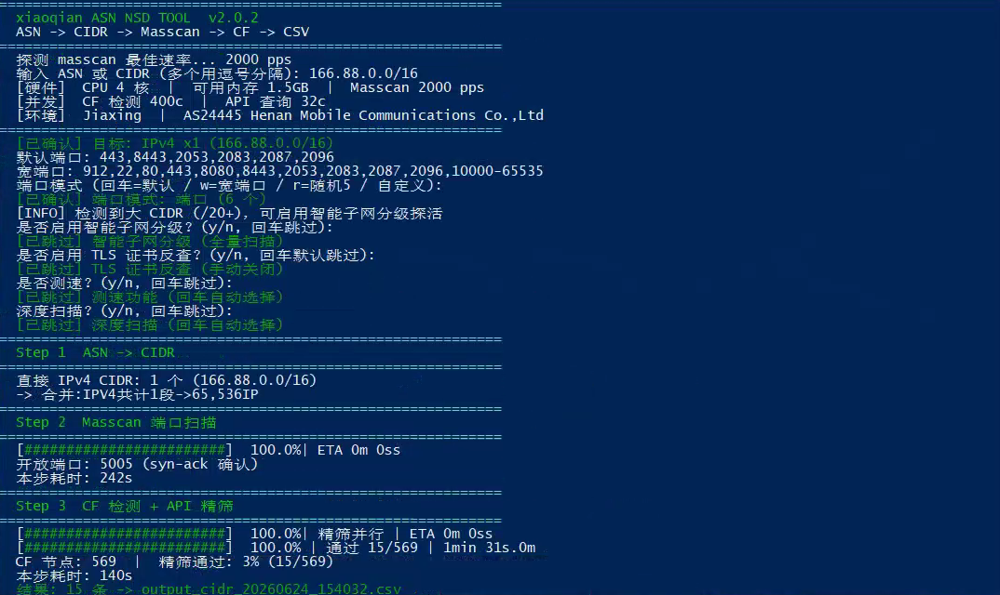
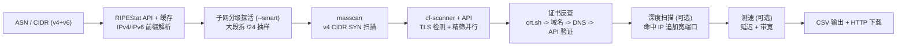

# IP-Tidy v2.1.0

> **xiaoqian ASN NSD TOOL** -- ASN / CIDR -> Masscan -> TLS 检测 -> CF 节点 CSV

支持 CLI 模式。一键输入 ASN 或 CIDR（支持 IPv4/IPv6），自动完成 IP 段解析、高速端口扫描、Cloudflare 反代节点检测、TLS 证书反查扩充节点池，输出结构化 CSV。



---

## 特性

| 特性 | 说明 |
|------|------|
| 双栈支持 | IPv4 / IPv6 CIDR 全链路解析、合并、去重、分离导出 |
| 智能子网分级 | 大 CIDR 自动拆 /24 抽样探活，仅扫活跃子段 (`--smart`) |
| 证书反查 | TLS SAN 提取 -> DNS 解析 -> API 交叉验证，自动扩充节点 |
| 离线 GeoIP | 内置 MaxMind GeoLite2 数据库，无需网络查 ISP/地区/ASN |
| 多输入源 | 支持 ASN 编号、CIDR 网段、混合输入 |
| 深度扫描 | 二阶段宽端口扫描，发现隐藏高位端口 |
| 流式流水线 | cf-scanner 与 API 精筛并行，缩短等待 |
| 硬件自适应 | 实测网卡上限，CPU/内存动态调参 |
| 断点续扫 | `--skip-masscan` 跳过扫描复用已有结果 |
| 端口拆分 | 超大范围自动拆批，进度平滑 |
| 端口模式 | 默认/宽端口/随机/自定义 四种端口选择 |
| ASN 缓存 | RIPEStat 结果 7 天缓存，失败回退 |
| 跨平台 | Linux / macOS / Windows (WSL2) |

---

## 快速开始

```bash
# 安装 (自动处理所有依赖)
curl -fsSL https://raw.githubusercontent.com/xiaoqian-1001/IP-Tidy/main/install.sh | bash

# 基础用法
ip-tidy AS209242                     # 单个 ASN
ip-tidy AS209242,AS3214              # 多个 ASN (逗号)
ip-tidy 1.2.3.0/24                   # 单个 IPv4 CIDR
ip-tidy 1.2.3.0/24,5.6.7.0/24      # 多个 IPv4 CIDR
ip-tidy 2001:db8::/32                # 单个 IPv6 CIDR
ip-tidy AS209242,1.2.3.0/24         # ASN + CIDR 混合

# 选项
ip-tidy AS209242 -p 443,8443         # 自定义端口
ip-tidy AS209242 -w                  # 宽端口 (55546 端口)
ip-tidy AS209242 -R                  # 随机 5 端口快速探测
ip-tidy AS209242 -d                  # 深度扫描 (命中 IP 追加宽端口)
ip-tidy AS209242 -s                  # 扫描后自动测速
ip-tidy AS209242 -r 4000             # 指定发包速率
ip-tidy AS209242 -w -d -s            # 组合使用
ip-tidy AS209242 --v4-only           # 仅处理 IPv4
ip-tidy AS209242 --v6-only           # 仅处理 IPv6 (导出 CIDR 列表)
ip-tidy AS209242 --smart             # 智能子网分级 (大 CIDR 自动探活)
ip-tidy AS209242 -g                  # 下载离线 GeoIP 数据库

# 断点续扫
ip-tidy AS209242 --skip-masscan      # 跳过 masscan，使用已有结果

# 管理
ip-tidy update                       # 更新到最新版
ip-tidy uninstall                    # 卸载
```

无参数运行自动进入交互模式，按提示输入即可。完成后自动启动 HTTP 下载服务。

---

## 离线 GeoIP (`-g`)

内置 MaxMind GeoLite2 免费数据库，下载后无需网络即可查询本机 ISP、地区、ASN。

```bash
# 首次使用: 下载离线数据库
ip-tidy -g
# 按提示访问 maxmind.com 免费注册获取 License Key
# 数据库保存到 ~/.config/ip-tidy/

# 日常运行自动优先使用离线库，无库时回退 ipinfo.io
ip-tidy AS209242
# 输出: [GeoIP] 离线数据库 (MaxMind GeoLite2)
#        地区: Shanghai, CN  机构: Alibaba
```

---

## IPv6 支持

| 功能 | 说明 |
|------|------|
| CIDR 输入 | `2001:db8::/32` 自动识别 IPv6 |
| ASN 前缀 | RIPEStat API 同步拉取 IPv6 前缀 |
| 合并去重 | `ipaddress.collapse_addresses` 自动合并 |
| 分离导出 | `--v4-only` / `--v6-only` 按协议族过滤 |
| 导出格式 | `--v6-only` 导出 `output_v6_*.csv` CIDR 清单 |

> masscan 仅支持 IPv4，`--v6-only` 模式自动跳过扫描阶段，直接导出前缀列表。

---

## 智能子网分级 (`--smart`)

大 CIDR（如 `/16`）自动拆分 `/24` 子网，每段抽样 3 个 IP 进行 TCP 443 探活，仅将活跃子网投入 masscan 扫描，大幅缩减无效扫描量。

```bash
ip-tidy 10.0.0.0/16 --smart
# /16 -> 256 个 /24 子段，每段抽 3 个 IP 探活
# 仅活子网进入 masscan，过滤死段 xx%
# 无存活时自动回退全量扫描
```

**原理：** Cloudflare 节点集中在特定 /24 子网内，大量 /24 完全无响应，跳过它们可将扫描时间压缩数倍。

---

## TLS 证书反查

扫描完成后自动从 [crt.sh](https://crt.sh) 证书透明度日志查询每个 CF 节点关联的域名，DNS 解析新 IP 后通过 API 交叉验证，合法 CF 节点自动合并入结果文件。无需 API Key。

| 步骤 | 说明 |
|------|------|
| CT 查询 | 通过 IP 查询 crt.sh 证书日志 |
| 域名提取 | 解析所有关联域名，过滤通配符 |
| DNS 解析 | 将域名解析为 IPv4 地址 |
| API 交叉验证 | 调用验证 API 确认 IP 属 CF |
| 结果合并 | 新节点写入 `verified.txt` |

无需额外参数，CF 检测步骤后自动执行。

---

## 工作流程



| # | 步骤 | 说明 |
|---|------|------|
| 1 | ASN/CIDR -> 前缀 | RIPEStat API 拉取 IPv4/IPv6 前缀 (7天缓存)，CIDR 直通 |
| 2 | 子网分级 (可选) | 大 CIDR 拆 /24 抽样探活，仅保留活跃子网 (`--smart`) |
| 3 | masscan | 自适应速率 SYN 扫描，XML 解析，仅保留 syn-ack |
| 4 | CF 检测 + 精筛 | Go cf-scanner TLS 握手检测 + API 二次验证 |
| 5 | 证书反查 | crt.sh CT 日志查询域名 -> DNS 解析 -> API 交叉验证 -> 合并入结果 |
| 6 | 深度扫描 (可选) | 对命中 IP 追加宽端口，两阶段产出最大化 |
| 7 | 多点测速 (可选) | TCP 延迟 + 多 URL 下载测速 |
| 8 | 输出 | 生成 CSV，启动临时 HTTP 下载服务 |

---

## 深度扫描 (`-d`)

第一阶段正常扫描默认端口，第二阶段对 cf-scanner 命中的 IP 追加 55546 个宽端口扫描。仅扫命中 IP 不全量 CIDR，在不大幅增加扫描时间的前提下最大化节点产量。

**使用场景：** 默认端口扫完后还想挖掘更多可用节点时追加。

---

## 安装方式

| 方式 | 命令 |
|------|------|
| 一键脚本 | `curl -fsSL https://raw.githubusercontent.com/xiaoqian-1001/IP-Tidy/main/install.sh \| bash` |
| 手动安装 | `git clone --depth 1 https://github.com/xiaoqian-1001/IP-Tidy.git ~/IP-Tidy && cd ~/IP-Tidy/cf-scanner-src && go build -o ../cf-scanner main.go` |

**Windows** 用户先安装 WSL2：`wsl --install`，重启后在 Ubuntu 终端执行一键安装。

---

## 输出示例

```
Download - 按回车关闭服务
http://192.168.1.100:8899/output_AS209242_20260623_120000.csv
http://1.2.3.4:8899/output_AS209242_20260623_120000.csv
```

| 列 | 示例 | 说明 |
|---|---|---|
| IP地址 | `162.159.192.1` | Cloudflare 节点 IP |
| 端口 | `443` | 开放端口 |
| TLS | `TRUE` | 是否启用 TLS |
| 数据中心 | `HKG` | Cloudflare 机房代码 |
| 地区 | `HK` | 国家/地区 |
| 城市 | `Hong Kong` | 城市 |
| 网络延迟 | `42` | ms |
| 下载速度 | `5.12` | Mbps |
| ASN | `AS209242` | 来源 ASN |
| 协议 | `IPv4` | IPv4 或 IPv6 |

---

## 项目结构

```
IP-Tidy/
  run.py                 CLI 模式入口，终端交互 + 渲染
  verify.py              API 精筛 (含重试)
  lib/
    scanner_utils.py     共享工具层 (pure function，无副作用)
    scanner_pipeline.py  共享扫描管道层 (CLI/WEB 共用)
    utils.py             终端工具 (进度条 / 网络检测 / 端口解析)
    geoip.py             离线 IP 地理信息查询 (MaxMind GeoLite2)
  cf-scanner-src/        Go 源码 (TLS 握手检测)
  cf-scanner             编译产物 (gitignore)
  install.sh             一键安装
  uninstall.sh           一键卸载
  ports.txt              TLS 端口列表
  Dockerfile
  VERSION
```

---

## 架构设计

代码分层：

```
lib/scanner_utils.py     纯函数层: CIDR 拆分、端口解析、子网探活、延迟测量、证书查询等
lib/scanner_pipeline.py  扫描管道层: ASN→CIDR、masscan、cf-scanner、verify、智能探活、证书反查
                         通过 progress_callback 报告进度
run.py                   CLI 入口: argparse + 终端交互 + 步骤编排 + 终端渲染
```

修改扫描逻辑只需改 `lib/scanner_pipeline.py`。

## 硬件自适应

启动时探测网卡发包上限，按 CPU 核数和内存自动调参：

| 参数 | 策略 |
|------|------|
| masscan 速率 | 实测网卡上限 x 80%，失败回退 CPU x 1000 |
| cf-scanner 并发 | `max(200, min(cores * 100, 500))` |
| API 并发 | `min(cores * 16, 32)` |
| 批次拆分 | 单批最大 5000 端口，自动拆分 |
| 测速并发 | 等于 API 并发，全部节点并行 |

---

## 依赖

| 组件 | 用途 |
|------|------|
| [masscan](https://github.com/robertdavidgraham/masscan) | 高速 SYN 端口扫描 |
| Go >= 1.22 | 编译 cf-scanner (TLS 握手检测) |
| Python >= 3.8 | 流程编排、API 验证 |
| maxminddb | GeoLite2 离线数据库读取 (pypi) |
| dnsutils | DNS 方式获取公网 IP |
| [RIPEStat API](https://stat.ripe.net/) | ASN -> CIDR (免费公开) |

> `install.sh` 自动安装所有依赖 (含 `pip3 install maxminddb`)。

### 环境限制

masscan 需要 `CAP_NET_RAW`。以下环境不可用：NAT 容器、OpenVZ/LXC (无特权模式)、WSL2 默认桥接。建议 KVM VPS 或物理机。

---

## 更新日志

### v2.1.0
- 智能子网探活: 大 CIDR 拆 /24 抽样 TCP 探测
- GeoIP 状态栏显示，服务器硬件信息
- RIPEStat ASN CIDR 解析 (7天缓存)
- crt.sh 证书反查 + curl 下载测速
- CSV 导出完整对齐 run.py 格式 (含协议列)
- v6-only 模式导出 CIDR 清单

### v2.0.3
- 证书反查改用 crt.sh CT 日志查询域名，替代 TLS 握手 SAN 提取，命中率大幅提升
- 修复证书反查通配符 SAN DNS 解析失败问题
- 修复 ASN 缓存空结果导致持续解析 0 CIDR
- 修复 print_step / print_banner 多余空行，精简输出
- TLS 证书反查交互默认改为跳过，需输入 y 开启
- 非交互模式输出 TLS 状态，不再静默运行
- ASN 和 TASK COMPLETE 输出格式调整
- 智能子网分级 (`--smart`): 大 CIDR 拆 /24 抽样 TCP 探活，仅扫活跃子段
- TLS 证书反查: 自动提取 SAN -> DNS 解析 -> API 交叉验证，扩充节点池
- ScannerConfig 新增 smart_mode / ip_mode 字段

### v2.0.1
- IPv6 CIDR 全链路: 解析/合并/去重/分离导出
- `--v4-only` / `--v6-only` 协议族过滤开关
- RIPEStat API 同步拉取 IPv6 前缀
- 离线 GeoIP: 内置 MaxMind GeoLite2，`-g` 下载更新
- CSV 新增协议列 (IPv4/IPv6)，v6-only 导出 CIDR 清单
- install.sh 自动安装 maxminddb 依赖

### v2.0.0
- 项目更名为 IP-Tidy (原 ASNIPtest)
- 新增 CIDR 直接输入支持 (ASN 与 CIDR 混合)
- 终端界面 ASCII 化重构 (原生控制台色、CMD 兼容)
- 深度扫描每批次即时反馈 + 结果合并显式对比
- 恢复 CSV HTTP 下载服务 (内网/公网双链接)
- masscan stderr 读取跨平台兼容 (线程方案)
- 交互优化: 输入项黄绿状态区分、已完成/跳过视觉反馈

### v1.5.0
- 流式流水线: cf-scanner 与 API 精筛合并执行
- TLS 握手检测: cf-scanner RSS 1.4GB -> 33MB
- 深度扫描 (`-d`): 两阶段产出最大化
- ASN CIDR 缓存: 7 天 TTL + 失败回退
- 断点续扫 (`--skip-masscan`)
- 端口批次拆分: 5000 端口/批
- 非 root 权限修复: sudo -n + stdin=DEVNULL

### v1.4.0
- 宽端口扩展: 912 + 10000-65535
- 随机端口权重优化 + 分批扫描
- 动态并发: CPU/内存实时监控

### v1.3.0
- masscan XML 输出解析 (syn-ack 过滤)
- 多点测速 + `-w` 宽端口模式

### v1.2.0
- ScannerConfig 数据类架构 + argparse CLI
- 多阶段 Dockerfile + 安装脚本加固

---

## 鸣谢

- [e13815332](https://github.com/e13815332) -- 原作者，项目架构与核心扫描流程
- [cmliu](https://github.com/cmliu) -- [CF-Workers-CheckProxyIP](https://github.com/cmliu/CF-Workers-CheckProxyIP) 公共 API
