<p align="center">
  <br>
  
  
  
  
</p>

<h1 align="center">IP-Tidy</h1>
<p align="center"><b>LITTLE MONEY ASN NSD TOOL</b></p>
<p align="center">ASN / CIDR &rarr; Masscan &rarr; TLS &rarr; CF Node CSV</p>

---

一键输入 ASN 或 CIDR，自动完成 IPv4 前缀解析、高速端口扫描、Cloudflare 边缘IP检测，最终输出结构化 CSV 结果文件。


---

## 特性

| 特征 | 说明 |
|------|------|
| 智能子网分级 | 大 CIDR 自动拆 /24 抽样探活，仅扫活跃子段 (`--smart`) |
| 深度挖掘 | 通过 IP 提取 /16 CIDR 二次全流程扫描，自动扩充IP |
| 蒙特卡洛搜索 | 通过 Monte Carlo 算法在 CIDR 网段中搜索最优 IP，自动追踪线路 (`--mcis`) |
| 离线 GeoIP | 内置 MaxMind GeoLite2，无需网络查 ISP / 地区 / ASN |
| 多输入源 | ASN 编号 / CIDR 网段 / 混合输入，任意组合 |
| 深度扫描 | 二阶段宽端口扫描，发现隐藏高位端口 |
| 硬件自适应 | 实测网卡上限，CPU / 内存动态调参 |
| 断点续扫 | `--skip-masscan` 跳过扫描，复用已有结果 |
| 端口拆分 | 超大端口范围自动拆批，扫描进度平滑 |
| 端口模式 | 默认 / 宽端口 / 随机 / 探口追加 / 自定义 |
| ASN 缓存 | RIPEStat 结果 7 天缓存，失败自动回退 |
| TCP/HTTP 延迟 | TCP + HTTP 双协议延迟测量 |
| CSV 增强 | IP位置 + ASN组织 + GeoIP 信息自动填充 |
| 跨平台 | Linux / macOS / Windows (WSL2) 全支持 |
| 增量扫描 | `-i` 仅扫描 ASN 新增 CIDR 段，结果与历史自动合并 |

---

## 快速开始

### 安装

```bash
# 一键安装，自动处理所有依赖
curl -fsSL https://raw.githubusercontent.com/xiaoqian-1001/IP-Tidy/main/install.sh | bash
```

### 基础用法

```bash
qian AS209242                     # 单个 ASN
qian AS209242,AS3214              # 多个 ASN（逗号分隔）
qian 1.2.3.0/24                   # 单个 IPv4 CIDR
qian 1.2.3.0/24,5.6.7.0/24      # 多个 IPv4 CIDR
qian AS209242,1.2.3.0/24         # ASN + CIDR 混合输入
```

### 常用选项

```bash
-p 443,8443    # 自定义端口
-w             # 宽端口模式 (55546 端口)
-R             # 随机 5 端口探测 (全端口范围)
-P 10          # 在常规端口上追加 N 个随机端口探活
-d             # 深度扫描 (命中 IP 追加宽端口)
-s             # 扫描后自动测速
-c             # CloudflareSpeedTest 测速优选工具 (可配合 --cfst-count)
--mcis         # Monte Carlo 搜索探测: 基于IP来源CIDR网段搜索最优节点
               # 快捷模式: qian mcis <ASN/CIDR> 跳过扫描直接运行
-i             # 增量扫描 (仅扫新增 CIDR，合并历史结果)
-r 4000        # 指定发包速率
--smart        # 智能子网分级 (大 CIDR 自动探活)
--cfst-count 30  # cfst 取前 N 条最优 IP (默认 15)
-g             # 下载离线 GeoIP 数据库
```

### 管理与组合

```bash
qian AS209242 -w -d -s -i         # 组合使用
qian AS209242 -c --cfst-count 20  # 扫描后自动 cfst 测速取前 20
qian AS209242 --mcis              # 蒙特卡洛搜索最优节点
qian mcis AS209242                # 快捷模式: 跳过扫描直接 MCIS 搜索
qian AS209242 --skip-masscan      # 断点续扫
qian update                       # 更新到最新版
qian uninstall                    # 卸载
```

> **提示**：无参数运行自动进入交互模式，按提示输入即可。完成后自动启动 HTTP 下载服务。

---

## 离线 GeoIP (`-g`)

内置 MaxMind GeoLite2 免费数据库，下载后无需网络即可查询本机 ISP、地区、ASN。

```bash
# 首次使用 — 下载离线数据库
qian -g
# 按提示访问 maxmind.com 免费注册获取 License Key
# 数据库保存到 ~/.config/ip-tidy/

# 日常运行自动优先使用离线库
qian AS209242
# 输出:
#   [GeoIP] 离线数据库 (MaxMind GeoLite2)
#   地区: Shanghai, CN  机构: Alibaba
```

> 离线库不可用时自动回退 ipinfo.io 在线查询。

---

## 智能子网分级 (`--smart`)

大 CIDR（如 `/16`）自动拆分 `/24` 子网，每段抽样 3 个 IP 进行 TCP 443 探活，仅将活跃子网投入 masscan 扫描，大幅缩减无效扫描量。

```bash
qian 10.0.0.0/16 --smart
# /16 -> 256 个 /24 子段，每段抽 3 个 IP 探活
# 仅活子网进入 masscan，过滤死段 xx%
# 无存活时自动回退全量扫描
```

> **原理**：Cloudflare IP集中在特定 /24 子网内，大量 /24 完全无响应，跳过它们可将扫描时间压缩数倍。

---

## 工作流程

```mermaid
graph LR
    A["ASN / CIDR"] --> B["RIPEStat API + 缓存<br/>IPv4 前缀解析"]
    B --> C["子网分级探活<br/>大段拆 /24 抽样"]
    C --> D["masscan<br/>IPv4 CIDR SYN 扫描"]
    D --> E["cf-scanner + API<br/>TLS 检测 + 精筛"]
    E --> F["IP 深度挖掘<br/>IP -> /16 CIDR 二次扫描"]
    F --> G["MCIS 搜索 (可选)<br/>Monte Carlo 最优IP探测"]
    G --> H["深度扫描 (可选)<br/>命中 IP 追加宽端口"]
    H --> I["延迟/带宽检测<br/>TCP + HTTP + 下载测速"]
    I --> J["CSV 输出 + HTTP 下载"]
```



| # | 步骤 | 说明 |
|:-:|------|------|
| 1 | 通过 ASN 提取 CIDR 网段 | RIPEStat API 拉取 IPv4 前缀（7天缓存），CIDR 直通 |
| 2 | 子网分级探活 | 大 CIDR 拆 /24 抽样探活，仅保留活跃子网 (`--smart`) |
| 3 | 基于 Masscan 执行端口扫描任务 | 自适应速率 SYN 扫描，XML 解析，仅保留 syn-ack |
| 4 | Cloudflare IP 检测与 API 精准过滤 | Go cf-scanner TLS 握手检测 + API 二次验证 |
| 5 | IP 深度挖掘探测 | 通过 IP 提取 /16 CIDR 二次全流程扫描 |
| 6 | MCIS 蒙特卡洛搜索 (可选) | 通过 Monte Carlo 算法在 CIDR 网段中搜索最优 IP (`--mcis`) |
| 7 | 深度扫描 | 对命中 IP 追加宽端口，两阶段产出最大化 |
| 8 | 网络延迟/带宽速率检测 | TCP + HTTP 延迟 + 多 URL 下载测速 |
| 9 | 输出 | 生成 CSV（含 IP位置 / ASN组织），启动 HTTP 下载服务 |

---

## 深度扫描 (`-d`)

第一阶段正常扫描默认端口，第二阶段对 cf-scanner 命中的 IP 追加 55546 个宽端口扫描。

```bash
qian AS209242 -d
# Phase 1: 默认端口扫描
# Phase 2: 对命中 IP 追加宽端口扫描
```

> **场景**：默认端口扫完后还想挖掘更多可用IP时追加。仅扫命中 IP，不全量 CIDR，在不大幅增加扫描时间的前提下最大化IP产量。

---

## 深度挖掘

扫描完成后根据通过的 IP 自动提取 `/16` CIDR 网段，对扩展后的网段重新执行完整扫描管道，发现同网段内更多可用IP。

```bash
qian AS209242
# 完成 CF 检测后自动提示:
#   [当前结果] 通过 5 个IP
#   是否启用深度挖掘？（y/n, 回车跳过）:
```

| 子步骤 | 说明 |
|:--|------|
| IP 提取 | 从通过IP中提取 IPv4 地址 |
| CIDR 转换 | 每个 IP 转为 /16 网段，去重合并 |
| 全量扫描 | masscan + cf-scanner + API 精筛完整管道 |
| 结果合并 | 新IP追加到 verified.txt，passed_count 自动累加 |

> 无需额外参数，扫描完成后交互确认即可执行。

---

## MCIS 蒙特卡洛搜索 (`--mcis` / `qian mcis`)

扫描完成后根据已通过 IP 提取 CIDR 网段，使用 Monte Carlo IP Searcher 在网段内搜索最优节点，自动替换原结果。结果自动附带 NextTrace 路由线路分析。

```bash
qian AS209242 --mcis
qian mcis AS209242         # 快捷模式: 跳过扫描，直接解析 ASN 运行 MCIS
```

| 参数 | 默认值 | 说明 |
|:--|------|------|
| 网段维度 | /24 | 从 IP 扩展的 CIDR 前缀长度 (交互模式可调) |
| 扫描预算 | 自动 | `max(3000, min(网段数 x 100, 50000))` 动态调整 |
| 并发数 | 200 | 并行探测数 |
| 搜索头 | 4 | Monte Carlo 搜索头数 |
| 波束宽度 | 32 | 波束搜索宽度 |
| TOP | 20 | 保留最优 IP 数 |
| 下载测速 | 5 | 实测下载速度的 IP 数 |
| --mcis-url | (空) | 自定义测速 URL |
| --mcis-host | (空) | 自定义测速 Host 头 |

**结果表格列**：

| IP 地址 | 延迟(ms) | 速度(MB/s) | 地区码 | 所属网段 | 线路 |
|:--|:--|:--|:--|:--|:--|

- 速度列空白时显示 `-`，有速度的 IP 优先排前面
- 线路列通过 NextTrace 自动判定：精品=绿色、优化=黄色、普通=白色
- 线路标签格式：`运营商｜线路类型｜品质等级`（如 `中国移动｜CMIN2｜精品`）
- `--mcis-url` / `--mcis-host`：自定义测速 URL 和 Host 头
- NextTrace 自动 TCP 探测（443 → 80 → ICMP 回退），超时 18s
- ASN 解析自动兼容 nexttrace `--table` 裸数字格式
- 未获取 ASN 时自动回退 ip-api.com 查询
- 路由表覆盖 15 条 ASN（CMIN2/CN2/CUII 精品，CMI/163/169/CMHK/教育网 优化）
- 未命中路由表的 ASN 显示为 `AS{asn:0>5}｜普通`（5 位零补位）
- 并发追踪从 20 降至 5，`待检测` 结果单线程重试

> MCIS 替换测速步骤。`qian mcis <ASN/CIDR>` 快捷模式跳过 Masscan / 深度挖掘，直接解析网段运行 MCIS。

---

## 安装方式

| 方式 | 命令 |
|:--|------|
| 一键脚本 | `curl -fsSL https://raw.githubusercontent.com/xiaoqian-1001/IP-Tidy/main/install.sh \| bash` |
| 手动安装 | `git clone --depth 1 https://github.com/xiaoqian-1001/IP-Tidy.git ~/IP-Tidy && cd ~/IP-Tidy/cf-scanner-src && go build -o ../cf-scanner main.go` |

> **Windows**：先安装 WSL2 (`wsl --install`)，重启后在 Ubuntu 终端执行一键安装。

---

## 输出示例

```
Download - 按回车关闭服务
http://192.168.1.100:8899/output_AS209242_20260623_120000.csv
http://1.2.3.4:8899/output_AS209242_20260623_120000.csv
```

| 列 | 示例 | 说明 |
|:--|------|------|
| IP地址 | `162.159.192.1` | Cloudflare IP |
| 端口 | `443` | 开放端口 |
| TLS | `TRUE` | 是否启用 TLS |
| 数据中心 | `HKG` | Cloudflare 机房代码 |
| IP位置 | `Hong Kong, HK` | 城市 + 国家 |
| 地区 | `HK` | 国家/地区 |
| 城市 | `Hong Kong` | 城市 |
| 网络延迟 | `42` | ms |
| 协议 | `IPv4` | IPv4 |
| ASN | `AS209242` | 来源 ASN |
| ASN组织 | `Alibaba` | ASN 所属机构 |

---

## 项目结构

```
IP-Tidy/
  run.py                 CLI 入口 — 终端交互 + 步骤渲染
  verify.py              API 精筛 (含重试)
  lib/
    scanner_utils.py     纯函数工具层
    scanner_pipeline.py  扫描管道层 (ASNCIDR + masscan + CF + verify)
    utils.py             终端工具 (进度条 / 网络检测 / 端口解析)
    geoip.py             离线 GeoIP (MaxMind GeoLite2)
  cf-scanner-src/        Go 源码 (TLS 握手检测)
  cf-scanner             编译产物 (gitignore)
  install.sh             一键安装
  uninstall.sh           一键卸载
  ports.txt              TLS 端口列表
  Dockerfile / VERSION
```

---

## 架构设计

```text
lib/scanner_utils.py     纯函数层  — CIDR 拆分、端口解析、子网探活、延迟测量、证书查询
lib/scanner_pipeline.py  管道层    — ASN→CIDR、masscan、cf-scanner、verify、智能探活
                         signals   — progress_callback 报告进度
run.py                   CLI 入口  — argparse + 终端交互 + 步骤编排 + 终端渲染
```

> 修改扫描逻辑只需改 `lib/scanner_pipeline.py`。

---

## 硬件自适应

启动时探测网卡发包上限，按 CPU 核数和内存自动调参：

| 参数 | 策略 |
|:--|------|
| masscan 速率 | 实测网卡上限 x 80%，失败回退 CPU x 1000 |
| cf-scanner 并发 | `max(200, min(cores x 100, 500))` |
| API 并发 | `min(cores x 16, 32)` |
| 批次拆分 | 单批最大 5000 端口，自动拆分 |
| 测速并发 | 等于 API 并发，全部IP并行 |

---

## 依赖

| 组件 | 用途 |
|:--|------|
| [masscan] | 高速 SYN 端口扫描 |
| Go >= 1.22 | 编译 cf-scanner (TLS 握手检测) |
| Python >= 3.8 | 流程编排、API 验证 |
| maxminddb | GeoLite2 离线数据库读取 (pypi) |
| dnsutils | DNS 方式获取公网 IP |
| [RIPEStat API] | ASN -> CIDR (免费公开) |

> `install.sh` 自动安装所有依赖（含 `pip3 install maxminddb`）。

### 环境限制

masscan 需要 `CAP_NET_RAW`。以下环境不可用：
- NAT 容器
- OpenVZ / LXC (无特权模式)
- WSL2 默认桥接

> 建议 KVM VPS 或物理机部署。

### 友情提示

- 请勿使用主力机、大厂云服务器运行扫描任务
- 优先选用各类抗投诉 VPS
- 家用宽带切勿单日高频操作

---

## 更新日志

### v2.9.0

- [优化] 路由标签格式统一：`运营商｜线路类型｜品质等级`（`/` 替换为 `｜`），路由表扩展至 15 条 ASN
- [新增] `--mcis-url` / `--mcis-host` 参数：自定义测速 URL 和 Host 头
- [优化] traceroute 可靠性：TCP 443 → 80 → ICMP 自动回退，超时 18s，兼容 nexttrace `--table` 裸数字格式和 hostname 列偏移
- [新增] ASN 回退查询：nexttrace 未获取 ASN 时自动调用 ip-api.com
- [优化] 默认不设第三方测速 URL，防止链接失效
- [优化] 路由追踪自动执行，移除交互确认提示
- [优化] 并发追踪 20 → 5，`待检测` 结果单线程重试（25s 超时）
- [优化] 线路列宽度 18 → 24，容纳最长 CJK+ASCII 混合标签

### v2.8.0

- [新增] NextTrace 路由线路分析：MCIS 结果自动追踪每条 IP 的 ASN 线路，表格新增"线路"列（精品=绿、优化=黄、普通=白）
- [新增] 探测阶段自动终止：best 持续 6000ms 时自动终止 MCIS，跳过快测速阶段
- [优化] 预算全自动计算：`max(3000, min(网段数 x 100, 50000))`，移除手动输入
- [优化] 结果表排序：有下载速度的 IP 优先排前面，空速度显示 `-`
- [优化] 表头精简：`下载速度(MB/s)` → `速度(MB/s)`
- [优化] 交互模式精简：移除所有 MCIS 参数提示，仅保留网段维度
- [优化] MCIS 历史结果保护：新跑成功前旧结果保留为 `.bkp`
- [修复] `--cfst-count 0` 被错误回退到默认值 15
- [清理] 删除重复代码、多余 proc.wait()、死代码

<details>
<summary>历史版本</summary>

### v2.7.0

- [新增] MCIS 蒙特卡洛搜索：基于已通过 IP 扩展 CIDR 网段，搜索最优节点 (`--mcis`)，替代传统测速步骤
- [新增] 下载测速过滤：MCIS 结果仅保留 `ok=true` 的 IP（TLS/下载验证通过），自动剔除无效节点
- [新增] 结果表增强：MCIS 和 CFST 均展示"地区码"列，MCIS 额外展示"所属网段"列
- [优化] MCIS 自动下载二进制，无需手动安装
- [优化] MCIS 结果完整替换原始 verified.txt，种子 IP 仅用于网段扩展

<details>
<summary>历史版本</summary>

### v2.6.0

- [新增] 1MB 快筛：CFST 测速前使用 1MB 文件快速预筛，候选池缩至 2xN，显著缩短测速耗时
- [新增] 加权评分：CFST 结果按 带宽x3 + 延迟x1 加权重排，替代裸下载速度排序
- [优化] CF-RAY 校验增强：大小写不敏感匹配 + 无 CF-RAY 时自动回退全部存活 IP
- [修复] `cf_download` 改用 http.client + socket 直连目标 IP，修复 urllib DNS 解析导致测速数据无效的问题
- [修复] `step_speed_test` done 变量未初始化崩溃
- [优化] cfst 进程 600s 超时兜底，防止进程 hung 卡死
- [优化] 滑动窗口测速修正：预热期正常消费数据不丢弃 + 下载 10MB 截断上限
- [清理] 异常精确化：移除 `cf_download` 裸 Exception，补 `tcp_latency` 的 socket.timeout 兼容

<details>
<summary>历史版本</summary>

### v2.5.0

- [新增] RTT 探测优化：单次 TCP 握手复用 HTTP `/cdn-cgi/trace` 探测，提取 CF-RAY 和 colo 信息
- [新增] colo 区域分组：按 colo 区域最小堆保留 Top-N，提升测速候选多样性

### v2.4.1

- [新增] RTT 预筛：当候选 IP 超过 cfst 上限时，自动 TCP 并发 RTT 排序精简候选池
- [清理] 移除实验性功能：自实现测速、CF-RAY 校验、裂变发现
- [清理] 代码重构：消除重复模式、提取公共函数、移除未用 imports

### v2.4.0

- [修复] cfst 进度条解析脆弱性问题，增加心跳回退机制
- [修复] install.sh 卸载删除错误路径
- [清理] 代码重构：魔法数字集中常量、`_run_masscan_batches()` 提取、`_format_csv_line()` 去重
- [优化] Dockerfile 交叉编译修复 (ARG TARGETARCH + GOARCH)

### v2.3.0

- [新增] 集成 CloudflareSpeedTest：扫描完成后可选对结果 IP 测速优选工具
- [新增] cfst 测速支持自定义取前 N 条 (`--cfst-count`)，默认 15
- [新增] cfst 测速实时进度条含 ETA 预估
- [新增] `-c` / `--cfst` 一键跳过交互直接测速
- [优化] Dockerfile 预下载 cfst 二进制

<details>
<summary>更早版本</summary>

### v2.2.5

- [清理] Masscan XML 解析逻辑抽取为 `parse_masscan_xml()` 公共函数，消除 3 处重复代码
- [清理] `main()` 函数拆分为 6 个子函数
- [清理] 清理 `scanner_pipeline.py` 和 `run.py` 未使用的导入
- [修复] `random_probe_ports()` 区间轮转 bug：`% 3` -> `% 4`
- [修复] 异常处理区分 `KeyboardInterrupt`，用户取消时退出码 130
- [修复] Go cf-scanner ANSI 转义在非 TTY 环境不再输出控制字符
- [优化] Dockerfile 工作目录 `ASNIPtest` -> `IP-Tidy`

### v2.2.4

- [新增] `-i` / `--incremental` 增量扫描：仅扫描 ASN 新增 CIDR 段，结果与历史自动合并去重

### v2.2.3

- [新增] `-P N` / `--probe-ports`：常规端口基础上追加 N 个随机端口探活
- [优化] `-R` 随机端口从加权区间改为全端口范围纯随机

### v2.2.2

- [新增] API 精筛阶段提取 probe 三段定时，直接填充延迟列
- [优化] 快捷命令由 `xiaoqian` 改为 `qian`
- [优化] 颜色体系重构：10色语义化分层
- [修复] `install.sh` 仓库路径 `ASNIPtest` -> `IP-Tidy`
- [修复] help 示例 `ip-tidy` -> `qian`

### v2.2.1

- [修复] `_pipeline` 后台 verify 线程重复执行导致总耗时翻倍
- [修复] 深度挖掘 masscan 进度条实时显示
- [修复] 测速导出 CSV 下载速度列空值问题
- [优化] 测速 / 深度挖掘补充 `本步耗时` 输出

### v2.2

- [优化] 深度挖掘输出格式精简，匹配主流程样式

### v2.1.1

- [新增] 深度挖掘：通过所获 IP 提取 /16 CIDR 二次全流程扫描
- [新增] HTTP 延迟：新增 HTTP HEAD 请求延迟测量
- [新增] CSV 增强：输出含 IP位置 / ASN组织列
- [清理] 移除 WEB 模式及相关代码

### v2.1.0

- [新增] 智能子网探活：大 CIDR 拆 /24 抽样 TCP 探测
- [新增] GeoIP 状态栏显示，服务器硬件信息
- [新增] RIPEStat ASN CIDR 解析 (7天缓存)

### v2.0.3

- [修复] ASN 缓存空结果导致持续解析 0 CIDR
- [修复] print_step / print_banner 多余空行
- [新增] 智能子网分级 (`--smart`)：大 CIDR 拆 /24 抽样 TCP 探活

### v2.0.1

- [新增] 离线 GeoIP：内置 MaxMind GeoLite2

### v2.0.0

- 项目更名为 IP-Tidy (原 ASNIPtest)
- 新增 CIDR 直接输入支持
- 终端界面 ASCII 化重构
- 深度扫描每批次即时反馈 + 结果合并显式对比
- 恢复 CSV HTTP 下载服务
- 修复 masscan stderr 读取跨平台兼容

### v1.5.0

- 流式流水线：cf-scanner 与 API 精筛合并执行
- 深度扫描 (`-d`)：两阶段产出最大化
- ASN CIDR 缓存：7 天 TTL + 失败回退
- 断点续扫 (`--skip-masscan`)

### v1.4.0

- 宽端口扩展：912 + 10000-65535
- 动态并发：CPU/内存实时监控

### v1.3.0

- masscan XML 输出解析 (syn-ack 过滤)
- 多点测速 + `-w` 宽端口模式

### v1.2.0

- ScannerConfig 数据类架构 + argparse CLI
- 多阶段 Dockerfile + 安装脚本加固

</details>

</details>

</details>

</details>

---

## 鸣谢

- [e13815332] -- 原作者，项目架构与核心扫描流程
- [cmliu] -- [CF-Workers-CheckProxyIP] 公共 API
- [XIU2] -- [CloudflareSpeedTest] 测速优选工具
- [Leo-Mu] -- [Monte Carlo IP Searcher] 最优节点搜索
- [nxtrace] -- [NTrace-core] 路由追踪引擎

[masscan]: https://github.com/robertdavidgraham/masscan
[RIPEStat API]: https://stat.ripe.net/
[e13815332]: https://github.com/e13815332
[cmliu]: https://github.com/cmliu
[CF-Workers-CheckProxyIP]: https://github.com/cmliu/CF-Workers-CheckProxyIP
[XIU2]: https://github.com/XIU2
[CloudflareSpeedTest]: https://github.com/XIU2/CloudflareSpeedTest
[Leo-Mu]: https://github.com/Leo-Mu
[Monte Carlo IP Searcher]: https://github.com/Leo-Mu/montecarlo-ip-searcher
[nxtrace]: https://github.com/nxtrace
[NTrace-core]: https://github.com/nxtrace/NTrace-core
